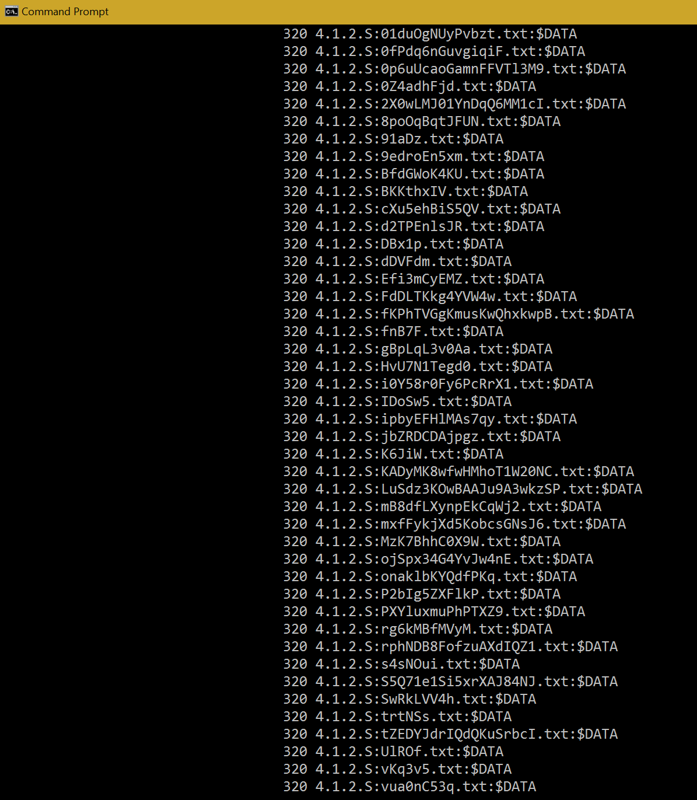

This portion of the project is a bit of malware that writes to alternate data streams with the purpose of using up disk space without the user knowing. While it wouldn’t be difficult to get rid of the new data streams, the target user would still have to know to look for ADS and know how to get rid of it. In the meantime, a substantial amount of space could be filled with garbage ADS.

The original plan was to have a script on a USB drive that would autorun once inserted, but that proved to be difficult with any Windows machine beyond Windows XP. One way of circumventing autorun was to create a CD file system on the USB drive, but that also turned out to be more difficult than expected.

The current implementation involves four documents on a USB drive: an autorun batch file, startup.bat, ads1.pyw, and filler.txt. 

Autorun would work on an XP machine with Admin authority, and it calls the startup.bat file. Startup.bat then sets a homefolder as its target and can either create an ADS on an existing file or create a new file with an ADS. The ADS would contain the contents of filler.txt, which I tested with as a 2GB file created using the command: “fsutil file createnew filler.txt 2000000000”. Running on a loop, I created a 9 GB ADS on my Windows 10 machine (not sure of any size limitations on ADS). Startup.bat also calls a python script called ads1.pyw as an alternative way of writing ADS. This script iterates through a given directory and creates ADS on each file, filled with the contents of the preceding file. The ADS are each named using a randomly generated alphanumeric sequence to make it more difficult to delete ADS via stream name. Changing the variable “runs” to 90+ also has the fun side effect of freezing the computer. 

Possible additions in the future would include a feature allowing for mapping of the target machine’s file system, and writing ADS to all those files. Currently, the target directory is hardcoded (also to prevent spamming our test machine), and it would need to be changed to a directory the attacker is fairly sure already exists on the target machine. 
